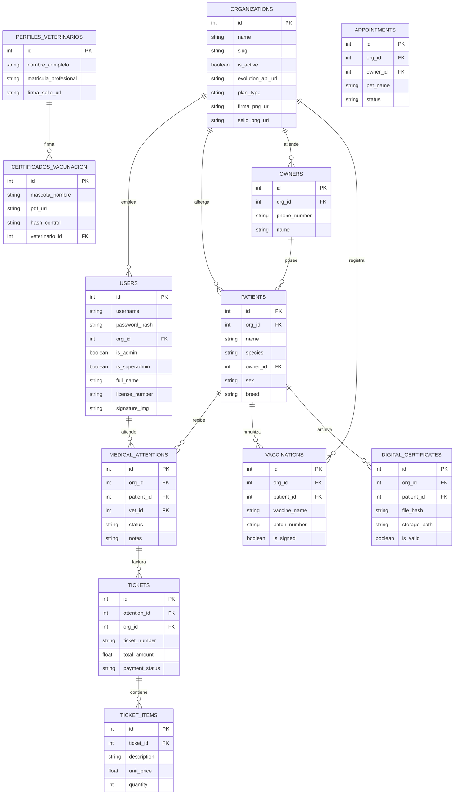

# Documentación Técnica y Arquitectura del Sistema: Veterinaria SaaS

Este documento engloba los aspectos críticos de la arquitectura, seguridad, diagrama de entidad relación (ERD), y las mejoras de performance implementadas en la versión de producción del sistema de Veterinaria SaaS.

## 1. Stack Tecnológico

*   **Backend Framework:** FastAPI (Asíncrono).
*   **Base de Datos Relacional:** PostgreSQL gestionado a través de Supabase.
*   **ORM (Object-Relational Mapping):** SQLAlchemy 2.0 (patrón asíncrono con `AsyncSession`).
*   **Almacenamiento (Storage):** Supabase Storage (Almacenamiento de Certificados PDF, imágenes de firmas y logotipos).
*   **Generación de Documentos:** ReportLab / fpdf2 para la creación en tiempo real de Certificados de Vacunación PDF con trazabilidad inmutable mediante hashes SHA-256.

## 2. Optimizaciones Críticas Implementadas

### A) Resolución del Problema de Consultas N+1 (Base de Datos)
Se implementó *Eager Loading* utilizando la instrucción `.options(selectinload(...))` proporcionada por SQLAlchemy en los siguientes servicios y enrutadores:
1.  **Attentions (`attentions.py`):** Carga anticipada de la entidad `Patient` al obtener atenciones médicas activas. Reduce O(N) queries a solo 2, descargando drásticamente el uso de conexiones del Pool en la tabla concurrente de atenciones.
2.  **SuperAdmin Panel (`superadmin.py`):** Carga pre-generada de `Organization` atada a los usuarios bajo listados en memoria global, omitiendo consultas repetitivas.
3.  **Finance y Endpoints Complejos:** Refinando con sentencias `join` y extracciones tempranas (`scalars().all()`) para evitar el lazily-loading oculto al serializar los reportes financieros.

### B) Securización de Interfaces de Red y SSRF mitigations
A través del análisis del linteador de seguridad *Bandit*, se parcharon peticiones HTTP Inseguras (`requests.get`) que actuaban sobre Storage remotos sin temporizadores (timeouts).
Se impone categóricamente `timeout=10` en los generadores de PDF (`pdf_service` y `generador_pdf`), garantizando que la aplicación evite agotar los "workers" ante caídas del Storage de Supabase.

### C) Prevención de Inyección SQL
Toda la suite de la base de datos aprovecha `sqlalchemy.select` y `.where`, los cuales nativamente parametrizan y sanean (bind params) las entradas de los usuarios, previniendo por completo cualquier inyección SQL tipo *1=1*. No existe ni un comando F-String inyectado a sesiones crudas.

---

## 3. Diagrama Entidad-Relación (ERD)

A continuación se detalla la estructura principal de la base de datos de producción mapeada directamente mediante herramientas de inferencia del Schema (PostgreSQL Meta).

---

*Documento y métricas generadas estáticamente en el proceso de consolidación de lanzamiento (Auditoría V1).*
